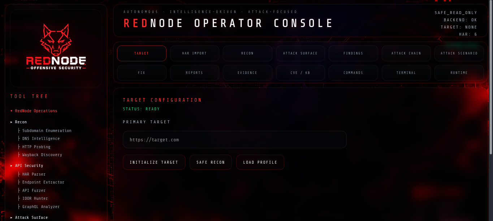
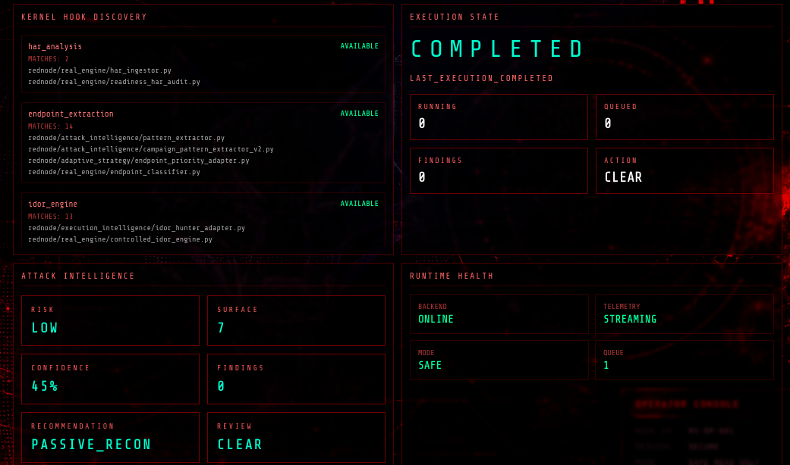
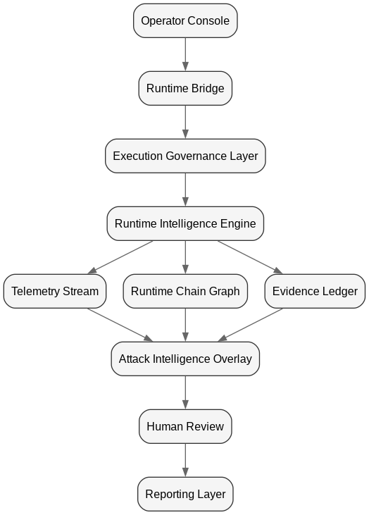
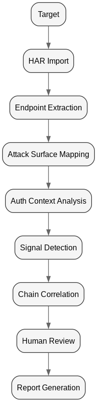
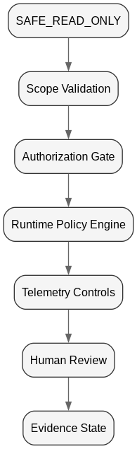
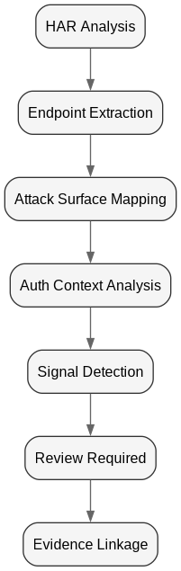

# RedNode

## Autonomous Offensive Security Intelligence Framework for Web/API Attack Surface Research

RedNode is an offensive security research framework focused on automated attack surface analysis, vulnerability hypothesis generation, runtime telemetry, evidence correlation, and attack-chain reasoning across modern web and API environments.

---

# What RedNode Does

RedNode is designed to move beyond traditional vulnerability scanning by treating security weaknesses as dynamic behavioral chains instead of isolated findings.

The framework combines:

- HAR-driven attack surface intelligence
- API and IDOR-oriented mutation analysis
- Runtime telemetry correlation
- Attack-chain reasoning
- Evidence lineage tracking
- Execution governance
- Autonomous offensive decision support

---

# Core Capabilities

## Attack Surface Intelligence

- HAR import and endpoint extraction
- Parameter discovery and classification
- API surface mapping
- Auth-context analysis
- Identity-boundary detection

## Offensive Mutation Engines

- IDOR/BOLA mutation workflows
- API fuzzing
- Response differential analysis
- Authorization desynchronization detection
- Behavioral anomaly analysis

## Runtime Intelligence

- Event bus orchestration
- Runtime telemetry snapshots
- Execution state machines
- Concurrent execution engine
- Autonomous runtime coordination

## Attack Intelligence Layer

- Attack chain correlation
- Runtime topology mapping
- Evidence linkage
- Campaign-level reasoning
- Signal propagation

## Governance & Safety

- Authorization gates
- Scope-aware execution
- Safe execution modes
- Evidence sensitivity handling
- Human-review checkpoints

---

# Architecture Overview

RedNode is built as a layered offensive security intelligence platform:

1. Operator Console
2. Runtime Bridge
3. Execution Governance Layer
4. HAR / Target Workspace
5. Attack Surface Intelligence
6. API / IDOR / Fuzzing Engines
7. Chain Graph / Runtime Topology
8. Evidence Ledger
9. Report Builder
10. Future AI Runtime Security Intelligence

See:

- docs/ARCHITECTURE.md
- docs/EXECUTION_PIPELINE.md
- docs/ATTACK_FLOW.md

---

# Execution Pipeline

TARGET_INIT
→ HAR_UPLOAD
→ ENDPOINT_EXTRACTION
→ ATTACK_SURFACE_MAPPING
→ AUTH_CONTEXT_ANALYSIS
→ IDOR/API_MUTATION
→ SIGNAL_DETECTION
→ CHAIN_CORRELATION
→ EVIDENCE_CAPTURE
→ HUMAN_REVIEW
→ REPORT_GENERATION

---

# Runtime Intelligence

RedNode contains a runtime-aware execution architecture focused on:

- telemetry-driven execution
- attack-chain propagation
- event-based orchestration
- runtime decision support
- evidence-aware workflows

The system is designed to evolve toward autonomous offensive security intelligence.

---

# Attack Intelligence Layer

The Attack Intelligence Layer extends traditional scanning into:

- attack chain reasoning
- campaign correlation
- runtime graph execution
- signal propagation
- temporal attack analysis
- offensive context enrichment

---

# Evidence & Reporting

RedNode emphasizes structured evidence generation and reporting:

- Evidence ledger
- Runtime snapshots
- Correlated findings
- Technical reporting
- Executive reporting
- Attack-chain visualization
- Remediation context

---

# Example Outputs

Example outputs and telemetry snapshots are located in:

docs/EXAMPLE_OUTPUTS.md

---

# Research Direction

RedNode research areas include:

- Autonomous offensive systems
- Runtime exploit topology
- AI attack surface intelligence
- Attack-chain reasoning
- Temporal security intelligence
- Cognitive offensive security
- Distributed authorization analysis
- Security telemetry correlation

---

# Legal / Authorized Use Only

RedNode is intended strictly for:

- authorized security research
- defensive validation
- bug bounty programs
- consulting engagements
- laboratory environments
- approved testing scopes

Unauthorized usage is prohibited.

---

# Screenshots

## Operator Console

## Runtime Intelligence & Attack Telemetry

---

# Runtime Intelligence Topology

Runtime-aware execution topology showing governance-aware telemetry propagation,
runtime intelligence orchestration, evidence correlation, and human review flow.

---

# Attack Chain Flow

High-level offensive intelligence execution flow focused on attack surface mapping,
signal correlation, runtime governance, and evidence-aware reporting.

---

# Governance Layer

Execution governance architecture responsible for:

- SAFE_READ_ONLY enforcement
- scope validation
- authorization gates
- runtime policy enforcement
- telemetry-aware execution control
- evidence-aware human review

---

# Runtime Chain Graph

Runtime chain propagation model visualizing:

- HAR ingestion
- endpoint extraction
- attack surface intelligence
- auth-context analysis
- signal escalation
- evidence linkage
- review boundaries

---

# Public Research Direction

Current public research directions include:

- Runtime-Aware Offensive Security
- Telemetry-Driven Security Intelligence
- Attack-Chain Correlation
- Execution Governance
- Behavioral Security Analysis
- Autonomous Security Research Pipelines
- Evidence Correlation Systems
- Runtime Graph Intelligence

